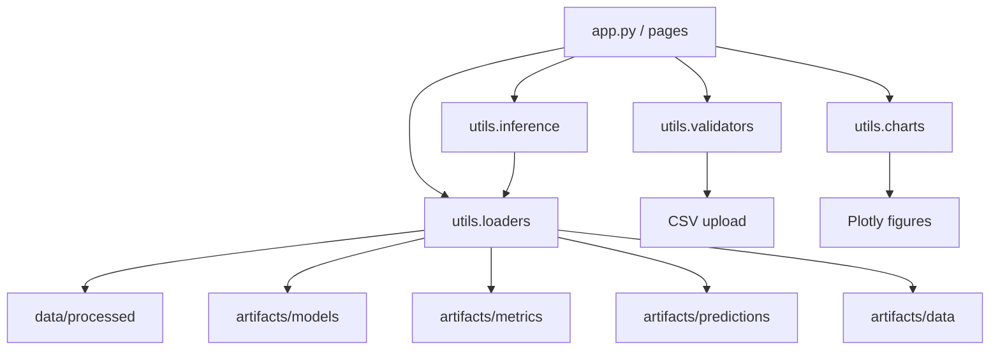

# OLIST CUSTOMER INSIGHTS
## Tài liệu Markdown hợp nhất từ bản `.docx` mới nhất, `README.md` và toàn bộ file code giao diện

> **Nguyên tắc hợp nhất**
>
> - **Nguồn ưu tiên cao nhất:** `Huong_dan_su_dung_he_thong_Olist_Customer_Insights.docx`
> - **Nguồn bổ sung kỹ thuật:** `README.md`
> - **Nguồn xác thực logic thực tế của hệ thống:** `app.py`, `1_Dashboard.py`, `2_Segmentation.py`, `3_Recommendation.py`, `4_Market_Basket.py`, `5_Prediction.py`, `6_Admin.py`, `config.py`, `loaders.py`, `validators.py`, `charts.py`, `inference.py`
>
> Tài liệu này được biên soạn lại thành **một file Markdown hoàn chỉnh**, ưu tiên nội dung bản `.docx` mới nhất, đồng thời đồng bộ với hành vi thật của code.

---

## Mục lục

1. [Giới thiệu chung](#1-giới-thiệu-chung)
2. [Phạm vi tài liệu](#2-phạm-vi-tài-liệu)
3. [Cấu trúc dự án và cách khởi động](#3-cấu-trúc-dự-án-và-cách-khởi-động)
4. [Kiến trúc chức năng tổng thể](#4-kiến-trúc-chức-năng-tổng-thể)
5. [Quy trình sử dụng khuyến nghị](#5-quy-trình-sử-dụng-khuyến-nghị)
6. [Hướng dẫn sử dụng chi tiết theo từng chức năng](#6-hướng-dẫn-sử-dụng-chi-tiết-theo-từng-chức-năng)
7. [Ràng buộc dữ liệu đầu vào và tệp CSV](#7-ràng-buộc-dữ-liệu-đầu-vào-và-tệp-csv)
8. [Kiến trúc kỹ thuật theo code](#8-kiến-trúc-kỹ-thuật-theo-code)
9. [Cơ chế fallback, preview và kiểm tra trạng thái hệ thống](#9-cơ-chế-fallback-preview-và-kiểm-tra-trạng-thái-hệ-thống)
10. [Danh sách artifact hệ thống đang tìm](#10-danh-sách-artifact-hệ-thống-đang-tìm)
11. [Mô tả từng file code](#11-mô-tả-từng-file-code)
12. [Lưu ý vận hành quan trọng](#12-lưu-ý-vận-hành-quan-trọng)
13. [Kết luận](#13-kết-luận)

---

## 1. Giới thiệu chung

**Olist Customer Insights** là hệ thống Streamlit hỗ trợ theo dõi đơn hàng, phân khúc khách hàng, gợi ý sản phẩm, phân tích mua kèm và dự đoán nhanh cho hoạt động bán hàng.

Hệ thống được tổ chức theo hướng một cổng truy cập tập trung, cho phép người dùng:
- xem tổng quan dữ liệu và các KPI bán hàng;
- phân nhóm khách hàng theo hành vi mua sắm;
- gợi ý sản phẩm theo khách hàng hoặc theo sản phẩm tương tự;
- khai thác luật kết hợp để hỗ trợ bán chéo;
- dự đoán nhanh đánh giá đơn hàng, cảm xúc bình luận và giá trị đơn hàng;
- kiểm tra tình trạng dịch vụ, dữ liệu đầu vào và làm mới bộ nhớ đệm.

### 1.1. Mục tiêu sử dụng

- Giúp người dùng nghiệp vụ theo dõi tình hình đơn hàng, đánh giá và hành vi mua sắm trong một giao diện tập trung.
- Hỗ trợ phân nhóm khách hàng để xây dựng hoạt động chăm sóc, giữ chân và tái kích hoạt.
- Cung cấp công cụ gợi ý sản phẩm, phát hiện luật mua kèm và dự đoán nhanh các tình huống vận hành.
- Cho phép người phụ trách hệ thống kiểm tra trạng thái dịch vụ, xác thực tệp đầu vào và làm mới bộ nhớ đệm khi cần.

---

## 2. Phạm vi tài liệu

Tài liệu này mô tả đầy đủ:
- cách khởi động hệ thống ở mức người dùng;
- cách điều hướng giao diện;
- quy trình sử dụng từng chức năng;
- ràng buộc dữ liệu đầu vào khi tải tệp CSV;
- kiến trúc kỹ thuật được rút ra từ code hiện tại.

### 2.1. Đối tượng sử dụng

- **Người dùng nghiệp vụ**: theo dõi vận hành, xem dashboard, phân tích khách hàng, gợi ý sản phẩm, khai thác mua kèm, dự đoán nhanh.
- **Người phụ trách hệ thống**: kiểm tra trạng thái module, xác thực file CSV, làm mới cache, đối chiếu artifact.

### 2.2. Điều kiện trước khi sử dụng

- Ứng dụng phải được khởi chạy và truy cập được qua trình duyệt web.
- Người dùng phải có quyền truy cập vào thư mục dự án hoặc môi trường triển khai.
- Một số chức năng chỉ hoạt động đầy đủ khi **dữ liệu lõi** và **artifact mô hình** đã sẵn sàng.
- Nếu thiếu artifact lõi, hệ thống có thể chạy ở chế độ **preview**, **demo** hoặc **fallback**.

---

## 3. Cấu trúc dự án và cách khởi động
---

##  Hướng dẫn tải và cài đặt Mô hình (Machine Learning Models)

Do giới hạn dung lượng của GitHub (100MB cho mỗi tập tin), các tệp mô hình Machine Learning có kích thước lớn (~1.4 GB) được lưu trữ riêng biệt trên Google Drive.

**1. Liên kết tải xuống:**
* [Google Drive - Olist Customer Insights Models](https://drive.google.com/drive/folders/1KeHjom1BTDa3YNhFubfFQPvaf_pn3AbS?usp=sharing)

**2. Các bước cài đặt:**
* Tải xuống toàn bộ các tập tin `.joblib` từ link trên.
* Di chuyển các tập tin vào thư mục: `artifacts/models/`
* Khởi chạy lại ứng dụng Streamlit.

**3. Kiểm tra trạng thái:**
* Truy cập trang **⚙️ Trung tâm vận hành (Admin)**. Hệ thống sẽ tự động chuyển trạng thái từ **🟡 Tạm thời (Demo)** sang **🟢 Sẵn sàng (Ready)** nếu file được đặt đúng chỗ.

---
### 3.1. Cấu trúc thư mục mong đợi

```text
your_project/
├─ app.py
├─ pages/
├─ utils/
├─ artifacts/
│  ├─ models/
│  ├─ metrics/
│  ├─ predictions/
│  ├─ plots/
│  └─ data/
└─ data/
   └─ processed/
```

### 3.2. Cơ chế xác định thư mục gốc

Theo `config.py`, hệ thống xác định project base theo thứ tự:
1. biến môi trường `OLIST_APP_BASE_DIR`;
2. thư mục làm việc hiện tại;
3. thư mục cha, ông cha của thư mục hiện tại;
4. thư mục suy ra từ vị trí file code.

Điều kiện để một thư mục được xem là gốc hợp lệ là có đồng thời:
- thư mục `artifacts/`
- thư mục `data/`

### 3.3. Cách cấu hình biến môi trường

#### Linux / macOS
```bash
export OLIST_APP_BASE_DIR=/path/to/your_project
```

#### Windows PowerShell
```powershell
$env:OLIST_APP_BASE_DIR="C:\path\to\your_project"
```

### 3.4. Cài thư viện

```bash
pip install -r requirements-ui.txt
```

### 3.5. Chạy ứng dụng

```bash
streamlit run app.py
```

### 3.6. Cách khởi động ở mức người dùng

1. Mở thư mục dự án Olist Customer Insights trên máy tính.
2. Trong môi trường Windows, có thể ưu tiên khởi động từ `START HERE.bat` nếu dự án có file này.
3. Sau khi hệ thống chạy, mở trình duyệt và truy cập địa chỉ ứng dụng, ví dụ `localhost:8501`.
4. Dùng thanh điều hướng bên trái để chuyển giữa các trang.

### 3.7. Lưu ý vận hành khi khởi động

- Nếu ứng dụng đã chạy nhưng không tự mở trình duyệt, có thể nhập thủ công địa chỉ truy cập.
- Nếu vừa cập nhật dữ liệu hoặc model, nên vào trang **Admin** và dùng chức năng **Làm mới bộ nhớ đệm** trước khi phân tích.

---

## 4. Kiến trúc chức năng tổng thể

### 4.1. Thanh điều hướng

| Mục điều hướng | Mục đích chính | Khi nên dùng | Kết quả đầu ra tiêu biểu |
|---|---|---|---|
| app (Trang chủ) | Giới thiệu hệ thống và chỉ số nhanh | Khi mới mở ứng dụng hoặc cần nhìn tổng quan rất nhanh | Mô tả chức năng, KPI nhanh, định hướng sử dụng |
| Dashboard | Theo dõi hiệu suất bán hàng và hành vi mua sắm | Khi cần xem số liệu chung, xu hướng, danh mục, trạng thái đơn | Biểu đồ, KPI và bảng tóm tắt kinh doanh |
| Segmentation | Phân khúc khách hàng theo hành vi | Khi cần tra cứu một khách hàng hoặc phân nhóm hàng loạt | Nhóm khách hàng, hồ sơ RFM, tệp kết quả phân khúc |
| Recommendation | Gợi ý sản phẩm | Khi cần đề xuất sản phẩm cho khách hàng hoặc sản phẩm tương tự | Danh sách top sản phẩm và tệp CSV tải về |
| Market Basket | Phân tích mua kèm | Khi cần xây combo, bán chéo hoặc đọc luật mua kèm | Luật FP-Growth, itemsets và biểu đồ |
| Prediction | Dự đoán nhanh | Khi cần dự đoán đánh giá, phân tích bình luận hoặc ước tính giá trị | Kết quả phân loại, điểm phân tích, giá trị ước tính |
| Admin | Kiểm tra vận hành | Khi cần biết trạng thái module hoặc xác thực tệp đầu vào | Bảng trạng thái dịch vụ, báo cáo kiểm tra file, thao tác bảo trì |

### 4.2. Các tính năng chính từ trang chủ

Trang `app.py` cung cấp:
- phần giới thiệu hệ thống;
- chỉ số nhanh: số đơn hàng, số khách hàng, điểm đánh giá trung bình, giá trị đơn hàng trung bình;
- số nhóm khách hàng cuối cùng;
- số luật mua kèm khả dụng cho UI;
- ba bước gợi ý bắt đầu sử dụng;
- danh sách các module chính.

---

## 5. Quy trình sử dụng khuyến nghị

Trình tự sử dụng đề xuất:

1. Vào **Dashboard** để đánh giá bức tranh tổng quan của dữ liệu.
2. Vào **Segmentation** để hiểu các nhóm khách hàng hoặc phân khúc một danh sách khách hàng.
3. Vào **Recommendation** để chọn sản phẩm đề xuất cho khách hàng hoặc tìm sản phẩm tương tự.
4. Vào **Market Basket** để tìm các nhóm sản phẩm nên bán cùng nhau.
5. Vào **Prediction** khi cần dự đoán nhanh một đơn hàng, một bình luận hoặc một giá trị đơn hàng.
6. Vào **Admin** khi cần kiểm tra trạng thái hệ thống, xác thực file CSV hoặc làm mới bộ nhớ đệm.

### 5.1. Khuyến nghị sử dụng chính thức

Trước khi dùng kết quả cho vận hành thật:
- cần kiểm tra trang **Admin** để xác nhận module ở trạng thái **Sẵn sàng**;
- nếu module ở trạng thái **Tạm thời**, kết quả có thể đang lấy từ dữ liệu minh họa hoặc preview thay vì artifact lõi.

---

## 6. Hướng dẫn sử dụng chi tiết theo từng chức năng

## 6.1. Dashboard – Theo dõi tổng quan

Trang Dashboard dùng để theo dõi nhanh hiệu suất bán hàng, chất lượng đơn hàng và hành vi mua sắm.

### 6.1.1. Điều kiện hiển thị
- Trang yêu cầu dữ liệu `orders_base_final`.
- Nếu không có dữ liệu, trang sẽ hiển thị cảnh báo và dừng.

### 6.1.2. Các bước thao tác
1. Chọn mục **Dashboard** trên thanh điều hướng.
2. Tại sidebar, chọn bộ lọc theo **Tỉnh/bang khách hàng**, **Danh mục chính** và **Trạng thái đơn hàng** nếu cần.
3. Quan sát hệ thống tự động cập nhật KPI sau khi lọc.
4. Kéo xuống để xem các biểu đồ.
5. Đọc bảng **Tóm tắt kinh doanh** ở cuối trang.

### 6.1.3. Thành phần hiển thị
- KPI đầu trang:
  - số đơn hàng;
  - số khách hàng;
  - điểm đánh giá trung bình;
  - giá trị đơn hàng trung bình;
  - tỷ lệ giao thành công.
- Khối thông tin nổi bật:
  - danh mục nổi bật;
  - số nhóm khách hàng;
  - số bộ lọc đang áp dụng.
- Biểu đồ:
  - phân phối review score;
  - phân phối giá trị thanh toán;
  - top danh mục chính;
  - phân phối trạng thái đơn hàng;
  - xu hướng đơn hàng theo tháng;
  - tỷ trọng nhóm khách hàng.
- Bảng tóm tắt kinh doanh:
  - khách hàng;
  - chất lượng đơn hàng;
  - giá trị đơn hàng;
  - vận hành.

### 6.1.4. Lưu ý
- Bộ lọc là tùy chọn.
- Dữ liệu hiển thị phụ thuộc vào dữ liệu đã nạp, không phải file người dùng tải lên tại thời điểm xem.
- Tỷ lệ giao thành công được tính theo `order_status == "delivered"`.

---

## 6.2. Segmentation – Phân khúc khách hàng

Trang Segmentation phục vụ ba nhu cầu:
- tra cứu phân khúc của một khách hàng;
- phân khúc hàng loạt từ tệp CSV;
- xem chân dung các nhóm khách hàng.

### 6.2.1. KPI đầu trang
Nếu có `kmeans_cluster_profile.csv`, hệ thống hiển thị:
- số nhóm khách hàng;
- số khách hàng đã gán nhóm;
- số bản ghi RFM.

### 6.2.2. Tab Tra cứu khách hàng
1. Mở tab **Tra cứu khách hàng**.
2. Nhập **Mã khách hàng**.
3. Bấm **Xem phân khúc**.
4. Đọc kết quả:
   - tên nhóm khách hàng;
   - mã nhóm;
   - bảng hành vi mua sắm RFM.

**Điều kiện bắt buộc**
- phải có `customer_id` hợp lệ;
- nếu không tìm thấy trong dữ liệu RFM, hệ thống có thể trả về lỗi hoặc preview.

### 6.2.3. Tab Phân khúc từ file CSV
1. Chuẩn bị một file CSV đúng cấu trúc.
2. Mở tab **Phân khúc từ file CSV**.
3. Tải file lên.
4. Hệ thống kiểm tra contract và hiển thị 20 dòng đầu tiên.
5. Nếu hợp lệ, bấm **Phân khúc khách hàng**.
6. Đọc bảng kết quả với các cột:
   - `assigned_cluster`
   - `segment_name`
   - `error`
7. Tải file kết quả `segmentation_result.csv`.

#### Cấu trúc bắt buộc của file RFM
| Tên cột bắt buộc | Kiểu dữ liệu kỳ vọng | Ràng buộc giá trị | Ý nghĩa sử dụng |
|---|---|---|---|
| recency_days | Số | >= 0 | Số ngày kể từ lần mua gần nhất |
| frequency_orders | Số | >= 0 | Số đơn hàng hoặc số lần mua |
| monetary_value | Số | >= 0 | Tổng giá trị mua sắm hoặc giá trị chi tiêu |

#### Ví dụ tối thiểu
```csv
recency_days,frequency_orders,monetary_value
12,4,450.5
85,2,120.0
210,1,75.0
```

#### Lỗi thường gặp
- thiếu cột;
- sai tên cột;
- cột số chứa chuỗi không chuyển được sang số;
- có giá trị âm.

### 6.2.4. Tab Chân dung nhóm khách hàng
1. Mở tab **Chân dung nhóm khách hàng**.
2. Xem ảnh scatter nếu có `kmeans_cluster_scatter_pca.png`.
3. Xem bảng hồ sơ từng nhóm.
4. Xem bảng hành động đề xuất.

Ngoài dữ liệu gốc, trang còn có thể hiển thị:
- dữ liệu preview đã gán nhóm;
- mô tả hành vi nhóm dựa trên:
  - `recency_days_mean`
  - `frequency_orders_mean`
  - `monetary_value_mean`
- chiến lược gợi ý từ cột `business_strategy` nếu có.

---

## 6.3. Recommendation – Gợi ý sản phẩm

Trang Recommendation gồm ba tab:
- **Theo khách hàng**
- **Theo sản phẩm**
- **Hướng dẫn sử dụng**

### 6.3.1. Tab Theo khách hàng
1. Nhập **Mã khách hàng**.
2. Chọn số lượng gợi ý từ **5 đến 20**.
3. Bấm **Lấy gợi ý**.
4. Đọc danh sách sản phẩm đề xuất.
5. Nếu cần, tải file `product_recommendations.csv`.

#### Điều kiện bắt buộc
- không để trống `customer_id`.

#### Cơ chế hoạt động
- Nếu khách hàng đã có lịch sử: ưu tiên **collaborative filtering**.
- Nếu khách hàng mới: dùng cơ chế **cold start popularity**.
- Nếu thiếu artifact lõi: dùng **preview payload**.

#### Các cột kết quả có thể xuất hiện
- Mã sản phẩm
- Danh mục
- Điểm gợi ý
- Đánh giá trọng số
- Giá trung bình
- Số lượt mua
- Điểm đánh giá trung bình
- Số lượt đánh giá
- Nguồn gợi ý

### 6.3.2. Tab Theo sản phẩm
1. Nhập **Mã sản phẩm**.
2. Chọn số sản phẩm tương tự từ **5 đến 20**.
3. Bấm **Tìm sản phẩm**.
4. Đọc danh sách sản phẩm tương tự.
5. Nếu cần, tải file `similar_products.csv`.

#### Điều kiện bắt buộc
- không để trống `product_id`.

#### Cơ chế hoạt động
- Nếu có model `item_knn_neighbors_model.pkl`: dùng độ tương đồng sản phẩm.
- Nếu không đủ dữ liệu: chuyển sang fallback hoặc preview.

### 6.3.3. Tab Hướng dẫn sử dụng
| Tình huống | Nên dùng | Giá trị |
|---|---|---|
| Muốn gợi ý cho khách hàng có lịch sử mua sắm | Theo khách hàng | Gợi ý gần với sở thích và hành vi mua trước đó |
| Khách hàng mới chưa có lịch sử | Theo khách hàng | Hệ thống ưu tiên sản phẩm phổ biến |
| Muốn bán chéo hoặc thay thế sản phẩm | Theo sản phẩm | Gợi ý các mặt hàng có mức độ tương đồng cao |

---

## 6.4. Market Basket – Mua kèm thông minh

Trang Market Basket hỗ trợ khai thác luật kết hợp và các nhóm sản phẩm phổ biến từ dữ liệu giỏ hàng.

### 6.4.1. Các bước thao tác
1. Chọn mức gợi ý:
   - Cân bằng
   - Mạnh hơn
   - Mở rộng
2. Tinh chỉnh ba ngưỡng:
   - support
   - confidence
   - lift
3. Chọn tùy chọn ẩn giá trị `unknown` nếu cần.
4. Chọn số luật muốn hiển thị.
5. Xem kết quả ở hai tab:
   - **Luật mua kèm**
   - **Nhóm sản phẩm phổ biến**

### 6.4.2. Thiết lập mặc định theo preset
| Mức gợi ý | Support mặc định | Confidence mặc định | Lift mặc định | Ý nghĩa sử dụng |
|---|---:|---:|---:|---|
| Cân bằng | 0.001 | 0.10 | 1.2 | Phù hợp cho phần lớn tình huống xem tổng quát |
| Mạnh hơn | 0.003 | 0.20 | 1.5 | Lọc chặt hơn để giữ các luật mạnh hơn |
| Mở rộng | 0.001 | 0.05 | 1.0 | Mở rộng tập luật để khám phá nhiều kết hợp hơn |

### 6.4.3. Ý nghĩa các chỉ số
- **Support**: mức độ một nhóm mua kèm xuất hiện trong toàn bộ giao dịch.
- **Confidence**: xác suất vế phải xuất hiện khi vế trái đã có trong giỏ hàng.
- **Lift**: độ mạnh của mối quan hệ so với trường hợp ngẫu nhiên.

### 6.4.4. Kết quả hiển thị
**Tab Luật mua kèm**
- số luật;
- mức lọc;
- trạng thái ẩn dữ liệu rỗng;
- bảng luật chi tiết;
- biểu đồ top luật theo lift;
- biểu đồ top luật theo confidence;
- gợi ý nổi bật nhất từ luật đầu tiên.

**Tab Nhóm sản phẩm phổ biến**
- bảng itemsets sau lọc;
- biểu đồ top itemsets theo support.

---

## 6.5. Prediction – Dự đoán và phân tích

Trang Prediction gồm ba tab:
- **Đánh giá đơn hàng**
- **Phân tích bình luận**
- **Ước tính giá trị đơn hàng**

### 6.5.1. Tab Đánh giá đơn hàng
1. Nhập các trường định lượng và phân loại.
2. Bấm **Phân tích đánh giá**.
3. Đọc kết quả:
   - Positive / Negative
   - độ tin cậy nếu model hỗ trợ
   - phân bố xác suất lớp nếu có `predict_proba`

#### Nhóm trường mặc định
| Nhóm trường | Trường | Giới hạn nhập liệu / ý nghĩa |
|---|---|---|
| Thời gian | purchase_year | Từ 2016 đến 2030 |
| Thời gian | purchase_month | Từ 1 đến 12 |
| Thời gian | purchase_day | Từ 1 đến 31 |
| Thời gian | purchase_hour | Từ 0 đến 23 |
| Thời gian | purchase_dayofweek | Từ 0 đến 6 |
| Số lượng / giá trị | Các trường số còn lại | Number input, không nhận giá trị âm |
| Phân loại | customer_state / main_category / payment_type_mode | Nhập theo giá trị phân loại hiện có |

#### Bộ biến mặc định nếu thiếu summary
- `item_count`
- `unique_products`
- `unique_sellers`
- `price_sum`
- `freight_value_sum`
- `price_mean`
- `payment_value_sum`
- `payment_installments_max`
- `basket_value`
- `purchase_year`
- `purchase_month`
- `purchase_day`
- `purchase_hour`
- `purchase_dayofweek`
- `customer_state`
- `main_category`
- `payment_type_mode`

### 6.5.2. Tab Phân tích bình luận
1. Nhập nội dung bình luận.
2. Hoặc dùng nút ví dụ nhanh:
   - Ví dụ tích cực
   - Ví dụ tiêu cực
   - Xóa nội dung
3. Bấm **Phân tích cảm xúc**.
4. Đọc kết quả:
   - Positive / Negative
   - score nếu model hỗ trợ

#### Ví dụ mặc định trong code
- tích cực: `produto excelente chegou rápido e bem embalado`
- tiêu cực: `produto ruim chegou com defeito e atraso`

### 6.5.3. Tab Ước tính giá trị đơn hàng
1. Điền các trường hiển thị trên form.
2. Bấm **Ước tính giá trị**.
3. Đọc giá trị đơn hàng dự kiến.

#### Nguồn xác định schema
- ưu tiên `regression_input_schema.json`;
- nếu thiếu thì dùng `regression_final_summary.json`.

---

## 6.6. Admin – Trung tâm vận hành

Trang Admin dành cho người phụ trách hệ thống hoặc người dùng nâng cao.

### 6.6.1. KPI tình trạng dịch vụ
Hệ thống hiển thị:
- số dịch vụ **Sẵn sàng**
- số dịch vụ **Tạm thời**
- số dịch vụ **Cần bổ sung**

### 6.6.2. Ý nghĩa trạng thái
- **🟢 Sẵn sàng**: đủ artifact lõi.
- **🟡 Tạm thời**: thiếu artifact lõi nhưng vẫn còn dữ liệu demo/preview.
- **🔴 Cần bổ sung**: chưa đủ artifact để hoạt động.

### 6.6.3. Tab Kiểm tra file đầu vào
1. Chọn loại dữ liệu:
   - `custom`
   - `rfm_upload`
   - `orders_base_final_minimal`
   - `ratings_df_minimal`
   - `transactions_df_minimal`
   - `regression_input_schema`
2. Tải lên file CSV.
3. Hệ thống hiển thị:
   - MD5
   - kích thước file theo số dòng × số cột
   - 20 dòng đầu
   - báo cáo kiểm tra JSON
4. Nếu hợp lệ, có thể tiếp tục dùng file cho nghiệp vụ tương ứng.

### 6.6.4. Tab Công cụ hệ thống
- Nút **Làm mới bộ nhớ đệm** sẽ xoá `st.cache_data` và `st.cache_resource`.
- Nên dùng sau khi cập nhật dữ liệu, model hoặc artifact.

---

## 7. Ràng buộc dữ liệu đầu vào và tệp CSV

### 7.1. Các contract kiểm tra dữ liệu

| Loại dữ liệu | Cột bắt buộc | Ràng buộc bổ sung | Mục đích sử dụng |
|---|---|---|---|
| rfm_upload | recency_days, frequency_orders, monetary_value | Cả ba cột phải là số, không âm, giá trị >= 0 | Dùng cho Segmentation – Phân khúc từ file CSV |
| orders_base_final_minimal | customer_unique_id, review_score, payment_value_sum | review_score phải là số trong khoảng 1–5; payment_value_sum là số và không âm | Dùng để kiểm tra nhanh dữ liệu đơn hàng tối thiểu |
| ratings_df_minimal | customer_unique_id, product_id, review_score | review_score phải là số trong khoảng 1–5 và không âm | Dùng để kiểm tra dữ liệu đánh giá sản phẩm tối thiểu |
| transactions_df_minimal | order_id, product_category_name_english | Không có ràng buộc số đặc biệt ngoài sự hiện diện cột | Dùng để kiểm tra dữ liệu giao dịch tối thiểu |
| regression_input_schema | Lấy theo `feature_columns` của schema hiện hành | Cột bắt buộc được đọc động từ file schema của mô hình | Dùng để kiểm tra tệp đầu vào cho mô hình hồi quy |
| custom | Không bắt buộc | Kiểm tra tự do, không áp contract cố định | Dùng cho kiểm tra sơ bộ |

### 7.2. Nguyên tắc kiểm tra file CSV
- Tên cột phải đúng chính tả như contract yêu cầu.
- Hệ thống không tự đổi tên cột.
- Nếu cột số chỉ chứa chuỗi không chuyển đổi được sang số, file sẽ bị đánh dấu không hợp lệ ở bước `numeric_columns`.
- Nếu có giá trị âm ở cột phải không âm, file sẽ bị đánh dấu không hợp lệ ở `non_negative_columns` hoặc `range_rules`.

### 7.3. Logic kiểm tra trong `validators.py`

Quy trình xác thực gồm 4 lớp:
1. **required_columns**: có đủ cột bắt buộc hay không;
2. **numeric_columns**: các cột cần số có chuyển đổi được sang số hay không;
3. **non_negative_columns**: các cột không âm có chứa giá trị âm hay không;
4. **range_rules**: các cột có nằm trong khoảng cho phép hay không.

Báo cáo cuối cùng trả về:
- `ok`
- `row_count`
- `column_count`
- `checks`

---

## 8. Kiến trúc kỹ thuật theo code

### 8.1. Tổng quan luồng xử lý



### 8.2. `config.py`
`config.py` chịu trách nhiệm:
- định nghĩa `AppPaths`;
- xác định thư mục gốc dự án;
- dựng toàn bộ đường dẫn chuẩn:
  - `processed_dir`
  - `artifact_dir`
  - `models_dir`
  - `metrics_dir`
  - `predictions_dir`
  - `plots_dir`
  - `data_artifact_dir`

### 8.3. `loaders.py`
`loaders.py` là tầng đọc dữ liệu trung tâm của UI. File này cung cấp:
- loader cho bảng dữ liệu:
  - `load_processed_table`
  - `load_metric_csv`
  - `load_prediction_csv`
  - `load_data_artifact_csv`
- loader cho JSON:
  - `load_metric_json`
  - `load_prediction_json`
  - `load_model_json`
  - `load_summary_json`
  - `load_integration_payload`
- loader cho model:
  - `load_joblib_model`
  - `load_pickle_model`
- loader cho text và plot:
  - `load_text_asset`
  - `load_plot_path`
- kiểm tra file:
  - `file_exists`
  - `resolve_file`
  - `describe_file`
- đánh giá trạng thái module:
  - `_module_registry`
  - `evaluate_artifact_group`
  - `get_module_statuses`
  - `get_module_status`
- bảo trì:
  - `clear_loader_caches`

#### Điểm kỹ thuật quan trọng
- Dùng `@st.cache_data` cho dữ liệu tĩnh.
- Dùng `@st.cache_resource` cho model.
- Hỗ trợ tìm file theo `.parquet`, `.csv`, `.json` hoặc đường dẫn tuyệt đối.
- Có khả năng fallback giữa artifact chính và bản demo/preview.

### 8.4. `validators.py`
`validators.py` chịu trách nhiệm chuẩn hoá và kiểm tra dữ liệu đầu vào:
- kiểm tra cột bắt buộc;
- kiểm tra dữ liệu số;
- kiểm tra không âm;
- kiểm tra khoảng giá trị;
- dựng báo cáo validate chuẩn hóa;
- áp contract kiểm tra cho từng loại file CSV.

### 8.5. `charts.py`
`charts.py` gom toàn bộ hàm dựng biểu đồ Plotly và chuẩn hóa DataFrame cho UI. Các nhóm chính:
- biểu đồ Dashboard:
  - `plot_review_distribution`
  - `plot_payment_histogram`
  - `plot_cluster_share`
  - `plot_top_categories`
  - `plot_order_status_distribution`
  - `plot_monthly_orders`
- biểu đồ cho FP-Growth:
  - `plot_rules_bar`
  - `plot_itemsets_bar`
- bảng trạng thái:
  - `summary_status_dataframe`
- KPI cards:
  - `plot_metric_cards`

### 8.6. `inference.py`
`inference.py` là trung tâm suy luận nghiệp vụ của UI. File này gom toàn bộ logic model và preview/fallback thay vì nhét trực tiếp vào mỗi page.

#### Nhóm hàm prediction
- `predict_review_tabular`
- `predict_review_text`
- `predict_payment_value`

#### Nhóm hàm clustering
- `predict_customer_cluster`

#### Nhóm hàm recommendation
- `recommend_for_user`
- `recommend_similar_products`

#### Nhóm hàm market basket
- `get_association_rules`

#### Cơ chế kỹ thuật nổi bật
- tự động đọc model từ `joblib` hoặc `pickle`;
- tự động fallback sang `integration_ui_payload_preview.json` nếu thiếu model;
- tự động gắn metadata sản phẩm từ `product_lookup`;
- phân biệt người dùng cũ và mới trong recommendation;
- lọc association rules theo support, confidence, lift và `unknown`.

---

## 9. Cơ chế fallback, preview và kiểm tra trạng thái hệ thống

### 9.1. Triết lý graceful fallback

Theo `README.md` và code thực tế, ứng dụng được xây dựng theo hướng:

- **thiếu file nào thì báo file đó**;
- **không crash toàn bộ ứng dụng**;
- ưu tiên chạy bằng artifact chính;
- nếu thiếu artifact chính thì thử:
  - demo data;
  - preview payload;
  - fallback tables.

### 9.2. Trạng thái module trong `loaders.py`

#### Dashboard
- **required**
  - `data/processed/orders_base_final.parquet`
- **demo**
  - `data/processed/orders_base_final.csv`

#### Segmentation
- **required**
  - `data/processed/rfm_df.parquet`
  - `artifacts/models/rfm_standard_scaler.joblib`
  - `artifacts/models/kmeans_model.joblib`
  - `artifacts/metrics/kmeans_cluster_profile.csv`
- **demo**
  - `artifacts/predictions/rfm_clustered_kmeans.csv`

#### Recommendation
- **required**
  - `artifacts/models/best_surprise_model.pkl`
  - `artifacts/models/surprise_deployment_bundle.pkl`
  - `artifacts/models/seen_items_map.pkl`
- **demo**
  - `artifacts/predictions/integration_ui_payload_preview.json`
  - `artifacts/predictions/popular_products_fallback.csv`
  - `artifacts/predictions/sample_product_neighbors.csv`

#### Market Basket
- **required**
  - `artifacts/metrics/association_rules.csv`
  - `artifacts/metrics/frequent_itemsets.csv`

#### Prediction
- **required**
  - `artifacts/models/best_classifier_baseline.joblib`
  - `artifacts/models/best_classifier_text_tfidf.joblib`
  - `artifacts/models/best_regressor_baseline.joblib`
- **demo**
  - `artifacts/predictions/integration_ui_payload_preview.json`

#### Admin
- không có required artifact bắt buộc để tồn tại trang.

### 9.3. Cách xác định trạng thái
- Nếu đủ toàn bộ `required` → `ready`
- Nếu thiếu `required` nhưng có `demo` → `demo`
- Nếu thiếu cả `required` lẫn `demo` → `missing`

---

## 10. Danh sách artifact hệ thống đang tìm

### 10.1. Processed data
- `data/processed/orders_base_final.parquet`
- `data/processed/rfm_df.parquet`
- `data/processed/ratings_df.parquet`
- `data/processed/transactions_df.parquet`

### 10.2. Model artifacts
- `artifacts/models/best_classifier_baseline.joblib`
- `artifacts/models/best_classifier_text_tfidf.joblib`
- `artifacts/models/best_regressor_baseline.joblib`
- `artifacts/models/kmeans_model.joblib`
- `artifacts/models/gmm_model.joblib`
- `artifacts/models/rfm_standard_scaler.joblib`
- `artifacts/models/best_surprise_model.pkl`
- `artifacts/models/item_knn_neighbors_model.pkl`
- `artifacts/models/surprise_deployment_bundle.pkl`
- `artifacts/models/seen_items_map.pkl`

### 10.3. Metrics / predictions / plot / data artifact
- `artifacts/metrics/*.json`
- `artifacts/metrics/association_rules.csv`
- `artifacts/metrics/frequent_itemsets.csv`
- `artifacts/metrics/kmeans_cluster_profile.csv`
- `artifacts/predictions/sample_recommendations.csv`
- `artifacts/predictions/sample_product_neighbors.csv`
- `artifacts/predictions/popular_products_fallback.csv`
- `artifacts/predictions/integration_ui_payload_preview.json`
- `artifacts/predictions/rfm_clustered_kmeans.csv`
- `artifacts/plots/kmeans_cluster_scatter_pca.png`
- `artifacts/data/product_lookup.csv`
- `artifacts/data/candidate_items.csv`
- `artifacts/data/known_users.csv`

---

## 11. Mô tả từng file code

### 11.1. `app.py`
- cấu hình trang chính Streamlit;
- hiển thị landing page;
- đọc chỉ số nhanh từ dữ liệu và summary;
- định hướng người dùng tới các module khác.

### 11.2. `1_Dashboard.py`
- đọc `orders_base_final`;
- cho phép lọc theo khu vực, danh mục và trạng thái đơn;
- tính KPI động;
- dựng biểu đồ và bảng tóm tắt kinh doanh.

### 11.3. `2_Segmentation.py`
- tra cứu cụm của một khách hàng;
- nhận file CSV RFM và phân khúc hàng loạt;
- hiển thị chân dung từng cluster và hành động đề xuất;
- cho tải kết quả `segmentation_result.csv`.

### 11.4. `3_Recommendation.py`
- gợi ý sản phẩm theo khách hàng;
- gợi ý sản phẩm tương tự theo product;
- chuẩn hóa bảng hiển thị recommendation;
- cho tải `product_recommendations.csv` và `similar_products.csv`.

### 11.5. `4_Market_Basket.py`
- chỉnh threshold cho support, confidence, lift;
- lọc luật kết hợp;
- hiển thị rules và itemsets;
- trực quan hóa top rules theo lift hoặc confidence.

### 11.6. `5_Prediction.py`
- dựng form đầu vào động cho classification và regression;
- hỗ trợ phân tích review text;
- dùng summary/schema để quyết định feature hiển thị;
- cho phép dùng giá trị mặc định nếu summary chưa đủ.

### 11.7. `6_Admin.py`
- hiển thị tình trạng dịch vụ;
- xác thực file CSV theo contract;
- hiển thị checksum MD5;
- làm mới cache.

### 11.8. `config.py`
- quản lý toàn bộ đường dẫn chuẩn của dự án.

### 11.9. `loaders.py`
- tầng nạp dữ liệu, model, JSON và artifact trung tâm;
- hỗ trợ cache;
- hỗ trợ module status.

### 11.10. `validators.py`
- kiểm tra contract dữ liệu đầu vào;
- dựng báo cáo validate có cấu trúc.

### 11.11. `charts.py`
- chứa các hàm trực quan hóa tái sử dụng cho nhiều page.

### 11.12. `inference.py`
- chứa toàn bộ logic suy luận nghiệp vụ;
- gom model inference, recommendation, clustering, rule filtering;
- hỗ trợ preview/fallback.

---

## 12. Lưu ý vận hành quan trọng

### 12.1. Các tình huống thường gặp và cách xử lý

| Tình huống | Nguyên nhân thường gặp | Cách xử lý khuyến nghị |
|---|---|---|
| Không có kết quả gợi ý cho khách hàng | Để trống `customer_id` hoặc khách hàng chưa có dữ liệu đầy đủ | Kiểm tra lại mã khách hàng; nếu là khách mới, chấp nhận cơ chế cold start |
| Không tìm được sản phẩm tương tự | Để trống `product_id` hoặc sản phẩm chưa có lịch sử phù hợp | Kiểm tra lại `product_id`; quan sát thông điệp fallback/preview nếu có |
| Segmentation không chạy từ CSV | Thiếu cột hoặc dữ liệu số không hợp lệ | Đối chiếu lại ba cột bắt buộc và kiểm tra giá trị âm/chuỗi không hợp lệ |
| Dashboard không hiển thị | Thiếu `orders_base_final` | Kiểm tra trạng thái module tại Admin hoặc nạp dữ liệu |
| Kết quả có vẻ là minh họa | Module đang ở trạng thái `Tạm thời` | Xác nhận lại trạng thái `Sẵn sàng` trước khi dùng chính thức |
| Dữ liệu trên giao diện chưa cập nhật | Cache chưa được làm mới | Vào Admin và dùng **Làm mới bộ nhớ đệm** |

### 12.2. Nguyên tắc sử dụng an toàn
- luôn kiểm tra trạng thái module trước khi diễn giải kết quả;
- không giả định rằng mọi page đều đang dùng model chính thức;
- với prediction/regression, chỉ điền các trường đang hiển thị trên form;
- với CSV upload, phải đúng tên cột;
- với recommendation, cần phân biệt khách hàng cũ và khách hàng mới;
- với market basket, không nên đặt ngưỡng quá chặt ngay từ đầu vì có thể không còn luật nào hiển thị.

---

## 13. Kết luận

Olist Customer Insights là một hệ thống UI Streamlit được tổ chức khá rõ thành 6 mảng nghiệp vụ chính:
- tổng quan vận hành;
- phân khúc khách hàng;
- khuyến nghị sản phẩm;
- mua kèm thông minh;
- dự đoán nhanh;
- quản trị vận hành.

Bản Markdown này đã được hợp nhất theo nguyên tắc:
1. **lấy nội dung từ bản `.docx` mới nhất làm chuẩn chính**;
2. **bổ sung phần hướng dẫn chạy từ `README.md`**;
3. **đối chiếu và chèn thêm logic kỹ thuật thật từ toàn bộ file code**.

Kết quả là một tài liệu duy nhất vừa dùng được cho **người dùng cuối**, vừa đủ chi tiết cho **người triển khai hoặc người kiểm tra logic hệ thống**.
# group4_bigdata_machinelearning
